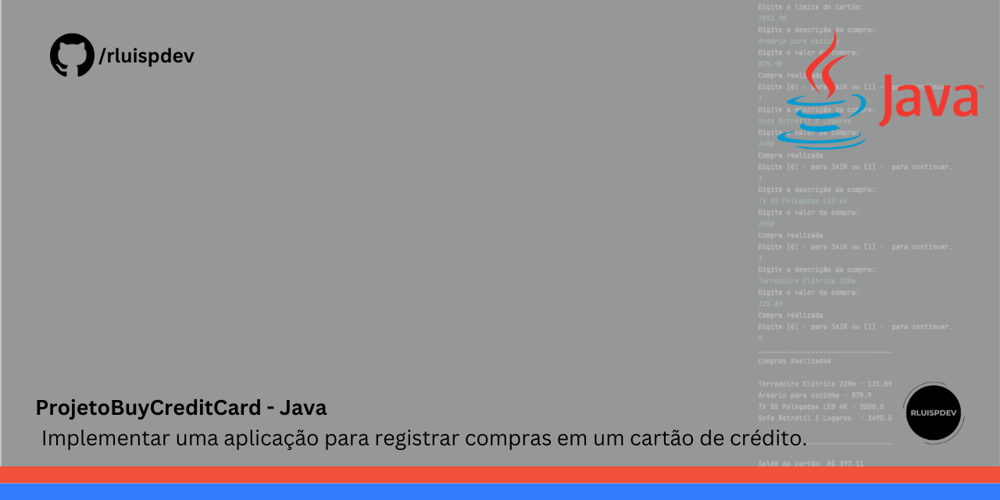

 # Resumo do projeto
Implementar uma aplicação para registrar compras em um cartão de crédito.

## 🔨 Objetivos do projeto

- `Class` : `Criar uma Classe Compra para Representar Transações:`   
- `Class` :`Criar uma Classe CartaoCredito para Gerenciar Limite e Compras` 
- `Lógica` :`Implementar a Lógica Principal no Método main`
  
## ✔️ Técnicas e tecnologias utilizadas

- ``ItelliJ IDEA CE``
- ``Java``
- ``OOP - Object-Oriented Programming``
- ``Terminal``
- ``Git, GitHub``
